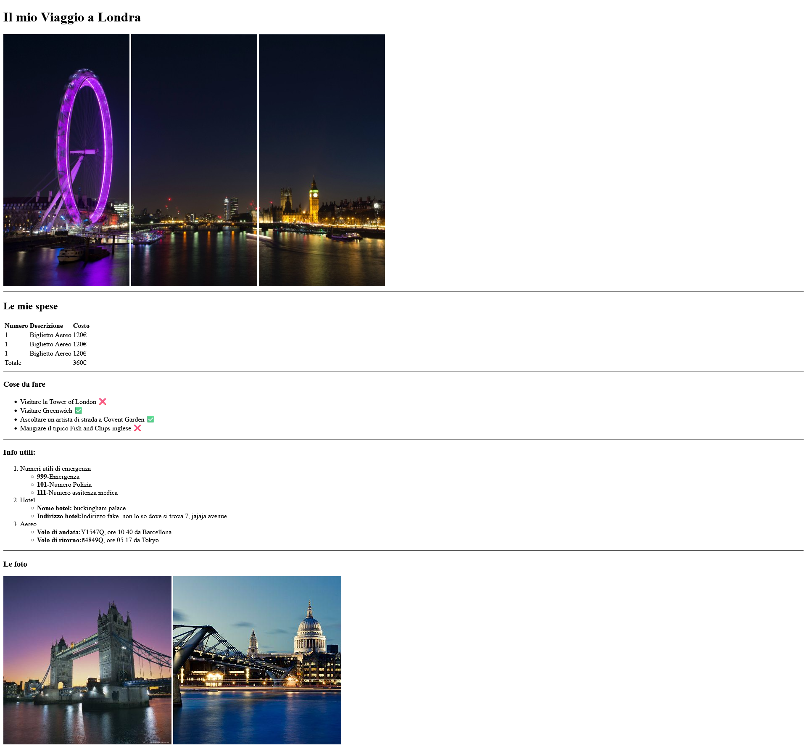

# html-london-trip

> **Breve descrizione:** Creazione di una web page utilizzando il layout in allegato, che tiene traccia delle attività da fare, numeri utili e spese per un ipotetico viaggio a Londra. Il progetto utilizza HTML per realizzare la struttura della pagina e gestire i percorsi delle immagini (assoluti e relativi).

---

## 📚 Tecnologie utilizzate

**Linguaggi e tecnologie:**

- **HTML:** Linguaggio di markup per strutturare il contenuto.

---

## 🎯 Obiettivi del progetto

📌 **Scopo principale:** Creare una web page utilizzando l'immagine in allegato come riferimento per il layout. La pagina dovrà mostrare informazioni utili per un viaggio a Londra, come la lista delle attività da fare, numeri utili e la traccia delle spese, mantenendo il layout il più fedele possibile all'immagine.

📌 **Competenze acquisite:**

- 🔹 Utilizzo dei tag base in HTML.
- 🔹 Gestione dei percorsi delle immagini in modo assoluto e relativo.

---

## Installazione e Avvio

Segui questi passaggi per installare e avviare il progetto:

```bash
# Clona il repository
git clone https://github.com/JoseManuel-Feliz/html-london-trip.git

# Entra nella cartella del progetto
cd html-london-trip
```

---

## 📸 Previews

### Layout di partenza

L'immagine di riferimento è disponibile nella cartella delle immagini.  
[Visualizza Screenshot](./img/Screenshot.jpg)

### Screenshot del Progetto Finito



---

## 📁 Struttura del progetto

```plaintext
/ html-london-trip
│-- /img
│-- index.html
│-- README.md
│-- LICENSE
```

---

## Contributi

Vuoi contribuire a questo progetto? Segui questi passaggi:

1. **Fai un fork** del repository
2. **Crea un nuovo branch** con la tua modifica:
   ```bash
   git checkout -b feature/NuovaFunzionalità
   ```
3. **Effettua le modifiche** e fai il commit:
   ```bash
   git commit -m "Aggiunta nuova funzionalità"
   ```
4. **Esegui il push** sul tuo repository:
   ```bash
   git push origin feature/NuovaFunzionalità
   ```
5. **Apri una Pull Request** su GitHub.

**Nota:** Assicurati di seguire le [linee guida per le contribuzioni](CONTRIBUTING.md) se presenti.

---

## 📝 Issue e Bug

Se trovi un **bug** o hai un'idea per migliorare il progetto, apri un'**issue** nella sezione ["Issues"](https://github.com/JoseManuel-Feliz/html-london-trip/issues).

**Come segnalare un bug:**

1. Vai alla sezione **Issues** del repository.
2. Clicca su **New Issue**.
3. Descrivi il problema in modo dettagliato.
4. Se possibile, allega screenshot o log di errore.

**Come proporre una nuova funzionalità:**

1. Vai alla sezione **Issues**.
2. Clicca su **New Issue**.
3. Seleziona **Feature Request**. _(Se non trovi questa opzione, crea comunque la issue e aggiungi manualmente l'etichetta `feature request` oppure indica nella descrizione che si tratta di una proposta di funzionalità.)_
4. Spiega il miglioramento proposto.

---

## 📜 Licenza

Questo progetto è distribuito sotto licenza **MIT**. Vedi il file [`LICENSE`](LICENSE) per maggiori dettagli.

---

## Contatti

👤 **Jose Manuel Feliz**

- GitHub: [@JoseManuel-Feliz](https://github.com/JoseManuel-Feliz)
- LinkedIn: [josemanuel-felizgarcia](https://linkedin.com/in/josemanuel-felizgarcia)
- Email: [jmgarcia1718@gmail.com](mailto:jmgarcia1718@gmail.com)

---

❤️ **Creato con passione durante il bootcamp Boolean!**
